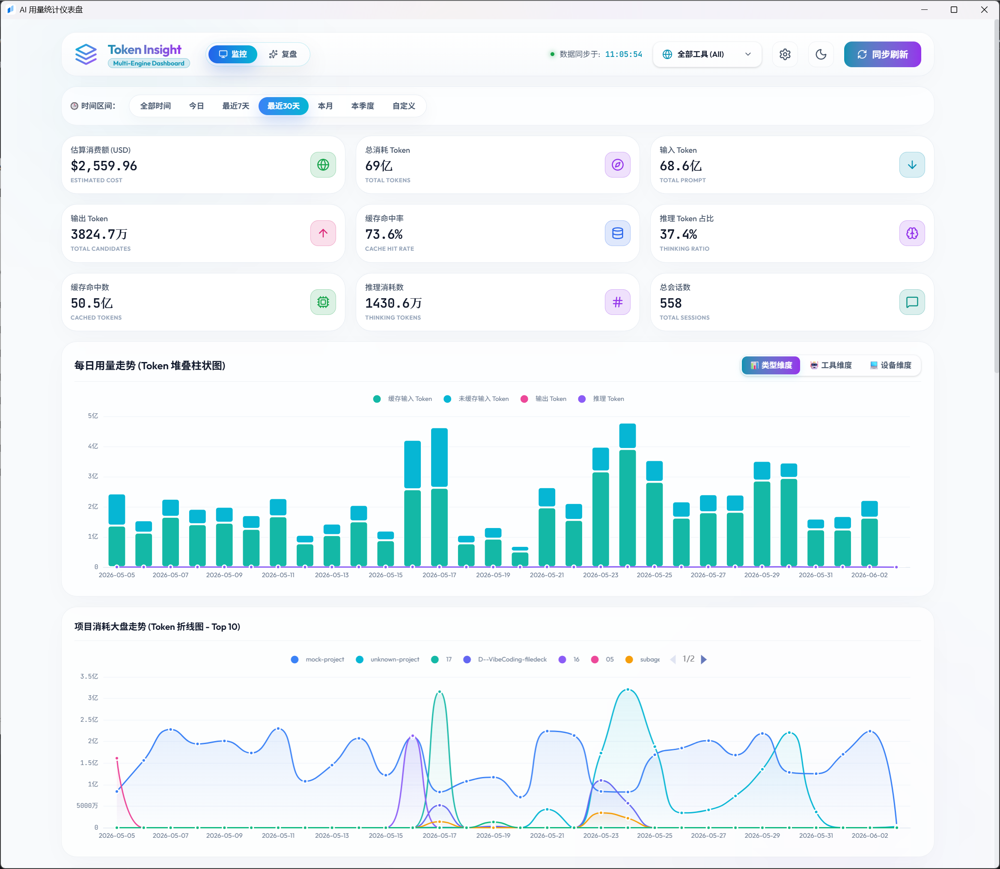

# 📊 Token Insight — 多终端 AI IDE Token 用量统计仪表盘

<p align="center">
  <strong>监控本地 AI IDE 的 Token 消耗，支持多个本地终端合并统计，让 AI 治理与用量一目了然。</strong>
</p>

<p align="center">
  <strong>看清每一次对话的 Token 消耗，打造极致流畅的本地用量统计大盘。</strong>
</p>

<p align="center">
  <a href="#"></a>
  <a href="#"></a>
  <a href="#"></a>
  <a href="#"></a>
  <a href="LICENSE"></a>
</p>

<p align="center">
  
</p>

**Token Insight** 是一款专为本地 AI 助手打造的 *Token 消耗用量统计仪表盘*（完美适配 Antigravity/Gemini、Claude Code、Codex、Cursor 等主流 AI 编程工具）。

它通过动态解码本地用量文件，直观呈现 API 用量明细、每日/月度使用趋势以及模型用量占比。

如果您需要一个**完全本地化运行、零外部依赖分发、执行极速且视觉 Premium** 的 AI 治理统计看板，这正是您所寻找的工具。

[快速开始](#-快速开始) · [技术亮点](#-核心优势与技术亮点) · [项目结构](#-项目结构) · [分发与打包](#-打包与分发) · [仪表盘说明](#-仪表盘使用说明) · [配置指南](#-配置指南) · [开源协议](#-开源协议)

---

### 适配的 AI 助手 & 数据库支持

<table>
  <tr>
    <td align="center" width="50%">
      <strong>🎯 适配的 AI 助手</strong>
      <br/>
      <sub>Antigravity / Gemini (完美支持)</sub>
      <br/>
      <sub>Claude Code / Codex 等 (后续计划)</sub>
    </td>
    <td align="center" width="50%">
      <strong>💾 支持的数据库</strong>
      <br/>
      <sub>内置 SQLite (本地无缝解析)</sub>
      <br/>
      <sub>企业级 PostgreSQL (高性能与集中化)</sub>
    </td>
  </tr>
</table>

---

## 🌟 核心优势与技术亮点

- **零依赖单文件分发** — 后端已基于 Rust 重构，SQLite/PostgreSQL 驱动在编译时以静态方式链接入二进制文件中，目标电脑无需安装 Python、Rust 运行时或任何 DLL，双击即用。
- **双模运行机制 (Tauri v2 + Axum)** — 既是一个原生 Tauri 桌面端应用，也同时在后台启动轻量级 Axum Web 服务，支持在浏览器中远程访问与多设备协同查看。
- **动态多用户适配** — 运行时自动读取 Windows 系统的 `%USERPROFILE%` 环境变量，自动加载当前登录用户的应用数据目录，无需手动修改任何路径。
- **极致的高并发性能** — 建立本地 SQLite 缓存库并结合 `mtime`（修改时间）监测机制进行增量同步。对于复杂的 SQLite 阻塞任务引入线程锁并在独立线程池中执行，避免高频刷新导致的锁争抢，增量扫描与 SQL 聚合耗时降至几毫秒。
- **数据库源热重载** — 前端提供直观的配置界面，支持 SQLite 路径及 PostgreSQL 数据库的分项/完整连接串配置，支持一键连接性测试。保存后自动写入后台 `.env` 配置文件，并触发连接池热重载生效，无需重启服务。
- **Premium 玻璃拟态视觉** — 采用流体渐变暗黑风格，包含多维度 KPI 看板、ECharts 输入/输出/缓存三层堆叠柱状图和推理折线混合走势图，支持会话列表实时搜索与动态表头排序。

---

## 🚀 快速开始

### 环境要求
- **Rust (Cargo) 1.75+** （用于编译 Rust 后端与 Tauri 壳）
- **Node.js 20+** 与 **pnpm / npm** （用于前端依赖安装与 Vite 编译）

### 从源码开发与运行 (Development)

```bash
# 克隆仓库
git clone https://github.com/your-username/token-insight.git
cd token-insight

# 安装前端依赖
pnpm install  # 或 npm install

# 在开发环境下启动服务
# 此命令会以开发模式运行 Vite 前端并启动 Tauri
pnpm tauri dev
```

### 独立 Web 服务启动 (Server Run)

如果您想脱离 Tauri 窗口，将其作为独立的后台 Web 服务运行：

```bash
# 1. 编译前端静态资源
pnpm build

# 2. 运行 Rust 后端 Web 服务
cd src-tauri
cargo run --release
```

服务默认在 `19362` 端口启动，您可以在浏览器中直接访问：
👉 **[http://localhost:19362](http://localhost:19362)**

*💡 **自定义端口**：如果需要指定端口启动，只需在运行命令后追加端口参数即可（例如使用 8080 端口）：*
```bash
cargo run --release -- 8080
```

---

## 📂 项目结构

```
token-insight/
├── src/                  # 前端核心代码 (React + TS + Tailwind CSS)
│   ├── components/       # 前端复用组件 (如 ECharts 图表组件)
│   ├── App.tsx           # 前端数据交互、图表渲染、会话搜索/排序主页面
│   ├── main.tsx          # 前端入口
│   └── index.css         # 玻璃拟态暗黑风格的全局样式规范
├── src-tauri/            # 后端核心代码 (Rust + Tauri v2 + Axum)
│   ├── src/
│   │   ├── main.rs       # 程序主入口，配置端口，启动后台服务及 Tauri 窗口
│   │   ├── server.rs     # Axum Web 路由设置、嵌入式静态资源分发与配置 API
│   │   ├── db.rs         # 本地 SQLite 缓存管理，增量会话同步算法和数据聚合查询
│   │   ├── db_adapter.rs # 多数据库连接适配器（SQLite / PostgreSQL 自动路由）
│   │   └── proto.rs      # Protobuf 字节流反序列化与信息解析
│   ├── migrations/       # Refinery 数据库版本迁移脚本
│   ├── Cargo.toml        # Rust 项目依赖配置文件
│   ├── tauri.conf.json   # Tauri 应用配置文件
│   └── .env.example      # 环境配置模板文件
├── vite.config.ts        # Vite 构建配置文件
└── package.json          # Node.js 项目依赖与构建脚本
```

---

## 📦 打包与分发

由于前端编译后的静态资源已使用 `rust-embed` 在编译时自动打包嵌入到 Rust 二进制程序中，因此打包后不需要携带任何静态资源文件：

1. **标准构建生产版本（推荐）**：
   在项目根目录下，运行以下命令来编译打包 Release 版本：
   ```bash
   pnpm tauri build
   ```
   Tauri CLI 会自动执行前端构建（`pnpm build`）、配置 Rust 生产编译特征（激活内置自定义协议 `custom-protocol`），并在 `src-tauri/target/release/bundle/` 目录下生成打包好的安装程序及可执行文件。

2. **原生 Cargo 编译单可执行文件**：
   如果您只需要编译出单个独立的 `.exe` 可执行文件（不生成安装程序），可以运行：
   ```bash
   pnpm build && cd src-tauri && cargo build --release
   ```
   *💡 注意：我们已经在 [src-tauri/Cargo.toml](src-tauri/Cargo.toml) 中配置了默认特性 `default = ["custom-protocol"]`，因此无论使用 `pnpm tauri build` 还是原生 `cargo build --release`，自定义文件服务协议都会被正确启用，不会出现 production 运行版前端去连接 localhost 开发服务器（即 5173 端口拒绝连接）的问题。*

3. **双击即用分发**：
   您只需将编译出的单个 `token-insight.exe`（在 `src-tauri/target/release/` 下）发送给其他 Windows 用户，对方直接双击运行即可，不需要附带任何外部 `.html`、`.css` 或 `.js` 静态资源文件。


---

## ⚙️ 配置指南

系统支持两种数据库源类型：**SQLite** 与 **PostgreSQL**。配置文件存放在 `src-tauri/.env`。

### 环境变量说明 (`.env.example`)

```ini
# 数据库类型配置 (支持 sqlite / postgres)
DATABASE_TYPE=sqlite

# SQLite 本地数据库路径 (DATABASE_TYPE=sqlite 时有效)
# 留空则默认使用路径: C:\Users\<Username>\.token-insight\token_stats.db
DB_SQLITE_PATH=

# PostgreSQL 分项配置 (DATABASE_TYPE=postgres 时有效)
DB_PG_HOST=127.0.0.1
DB_PG_PORT=5432
DB_PG_USER=postgres
DB_PG_PASSWORD=your_password_here
DB_PG_DATABASE=token_monitor
```

*💡 **提示**：除了手动配置 `.env` 之外，您也可以直接在运行后的仪表盘配置界面（点击右上角齿轮）进行图形化配置，点击连接测试并一键保存，后端将自动热重载，无需重启服务。*

---

## 📊 仪表盘使用说明

1. **KPI 核心看板**：实时展现总消耗 Token、未缓存输入、输出、总缓存命中数、缓存率（Context Caching 减免比例）、推理 Token 数及推理占比等关键指标。
2. **每日用量走势图**：由 **ECharts** 驱动的三层堆叠柱状图，直观展示每天的 **已缓存输入**（亮绿）、**未缓存输入**（亮蓝）、**输出**（亮粉）用量，并叠加 **推理 Token 走势**（亮紫）折线，悬停即可查看当天精确数据。
3. **模型分布与排行**：展示每个底层模型消耗的总 Token 排行进度条。
4. **会话用量明细**：详细列出所有交互会话。
   - **排序**：点击表头（如“总计 Token”、“创建时间”）支持升序与降序切换。
   - **搜索**：支持输入会话标题、UUID、模型名称，实现秒级过滤。
5. **同步刷新**：点击右上角 **“同步刷新”** 按钮，后端会立刻扫描自上次刷新以来有修改或新增的会话数据入库，并在毫秒级内重构渲染最新大盘数据。

---

## 🤝 参与贡献

欢迎提出 Issue 或提交 Pull Request 来帮助完善此项目！

## 📄 开源协议

本项目采用 [MIT License](LICENSE) 许可协议。
