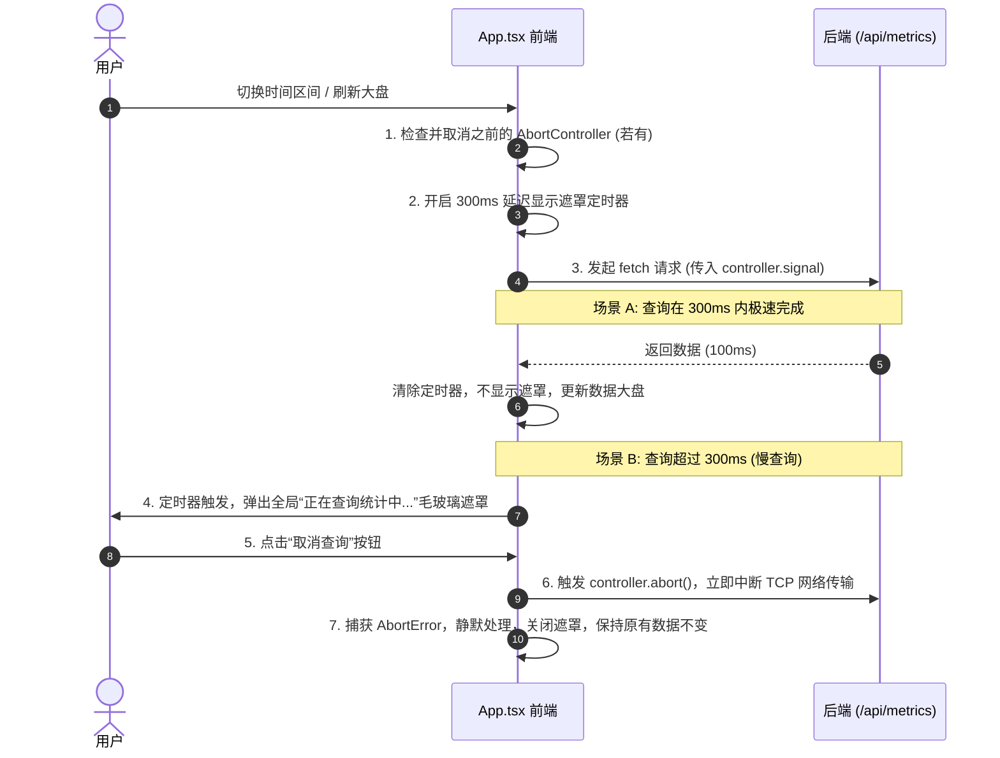

# 详细设计文档：正在查询统计中... 且支持取消

## 1. 背景与目标
在多终端 AI Token 监控大盘中，当用户切换不同的时间区间（如“全部时间”）、数据源或在系统刚完成大量数据同步时，拉取大盘指标的 API 请求（`/api/metrics`）在海量数据背景下可能会产生数秒甚至更长的延迟。

目前系统存在以下体验瓶颈：
1. **缺乏友好提示**：在大盘已有数据的情况下重新查询，界面仅有右上角的同步刷新按钮在旋转，对用户而言缺乏足够醒目的“正在查询统计中...”反馈。
2. **不支持取消**：如果查询耗时过长，用户只能处于被动等待状态，无法中途放弃或中断。
3. **竞态风险**：由于没有全局遮罩阻断用户操作，用户在等待期间可能频繁误点切换其他数据源或时间范围，导致产生多个并发的 HTTP 请求，容易出现“后发的请求先返回，先发的请求后返回”进而覆盖最新大盘数据的竞态冲突（Race Condition）。

为了解决上述问题，本项目设计了基于 **AbortController + 300ms 防闪烁延迟遮罩** 的联合方案。

---

## 2. 方案详解

### 2.1 技术选型与机制
本设计采用前端标准的 `AbortController` API 来控制查询请求的生命周期。



### 2.2 详细逻辑设计

#### 2.2.1 变量与状态管理 (`src/App.tsx`)
在 `App.tsx` 内声明以下 Refs 与状态：
```typescript
// 存储当前 fetch 的 AbortController 实例，用 Ref 规避 React 重新渲染的闭包问题
const abortControllerRef = useRef<AbortController | null>(null);

// 存储延时显示遮罩的定时器 ID
const loadingTimeoutRef = useRef<any>(null);

// 控制全局加载遮罩是否显示的独立状态
const [showDelayedLoading, setShowDelayedLoading] = useState(false);
```

#### 2.2.2 核心查询函数 (`fetchData`) 改造
```typescript
const fetchData = async (currentSource = source, start = startDate, end = endDate) => {
  // 1. 若有先前的请求尚未完成，先强行中止，实现竞态保护
  if (abortControllerRef.current) {
    abortControllerRef.current.abort();
  }

  // 2. 重置并开启 300ms 延时定时器，避免极速查询下遮罩层闪烁
  if (loadingTimeoutRef.current) {
    clearTimeout(loadingTimeoutRef.current);
  }
  setShowDelayedLoading(false);
  
  loadingTimeoutRef.current = setTimeout(() => {
    setShowDelayedLoading(true);
  }, 300);

  // 3. 实例化新的控制器并赋予 Ref
  const controller = new AbortController();
  abortControllerRef.current = controller;

  setLoading(true);
  setRefreshSpin(true);

  try {
    const response = await fetch(
      `/api/metrics?source=${currentSource}&start_date=${start}&end_date=${end}&t=${Date.now()}`,
      { signal: controller.signal }
    );
    
    if (!response.ok) throw new Error(`HTTP error! status: ${response.status}`);
    
    const result: AggregatedMetrics = await response.json();
    setData(result);
    
    const now = new Date();
    setLastUpdate(now.toTimeString().split(' ')[0]);
  } catch (error: any) {
    if (error.name === 'AbortError') {
      console.log('Query aborted successfully.');
    } else {
      console.error('Fetch data failed:', error);
    }
  } finally {
    // 4. 清理定时器和控制器
    if (loadingTimeoutRef.current) {
      clearTimeout(loadingTimeoutRef.current);
      loadingTimeoutRef.current = null;
    }
    
    // 仅当当前执行的 controller 是最新的那一次请求时，才恢复 loading 状态，防止被旧请求的 finally 覆盖
    if (abortControllerRef.current === controller) {
      setLoading(false);
      setRefreshSpin(false);
      setShowDelayedLoading(false);
      abortControllerRef.current = null;
    }
  }
};
```

#### 2.2.3 取消动作处理器 (`handleCancelQuery`)
```typescript
const handleCancelQuery = () => {
  // 1. 中止网络请求
  if (abortControllerRef.current) {
    abortControllerRef.current.abort();
    abortControllerRef.current = null;
  }
  
  // 2. 清除未触发的延时定时器
  if (loadingTimeoutRef.current) {
    clearTimeout(loadingTimeoutRef.current);
    loadingTimeoutRef.current = null;
  }
  
  // 3. 立即重置相关 Loading 状态
  setShowDelayedLoading(false);
  setLoading(false);
  setRefreshSpin(false);
};
```

---

## 3. UI/UX 视觉设计 (暗黑/明亮自适应毛玻璃)

新增的全局加载遮罩层，在 `showDelayedLoading && !(scanStatus && scanStatus.is_scanning)` 时渲染。其视觉效果需符合 `dashboard-ui-style` 规范，采用高端的 Glassmorphism 设计：

* **背景布局**：
  * 使用 `fixed inset-0` 铺满屏幕，配合 `z-[9999]` 置于顶层。
  * 浅色模式采用 `bg-white/70 backdrop-blur-md`，深色模式采用 `bg-[#030712]/75 backdrop-blur-md`。
  
* **卡片主体**：
  * 使用渐变边框和微弱发光阴影以凸显科技质感。
  
* **加载动效（Spinner）**：
  * 直径 `50px` 的圆环，其顶部和底部分别使用项目的 `neon-cyan` 和 `neon-purple` 渐变色，利用 `animate-spin` 进行匀速旋转。
  
* **提示文字**：
  * 主标题：“**正在查询统计中...**”（高对比度，粗体）。
  * 副标题：“*系统正在全力计算数据，请稍候*”（低饱和度次要文字）。

* **“取消查询”按钮**：
  * 一个醒目的、带有 Lucide `X` 或 `RefreshCw` 类似的取消按钮。
  * 样式推荐：`flex items-center gap-2 border border-red-500/30 hover:border-red-500 bg-red-500/5 hover:bg-red-500/10 text-red-500 px-4 py-2 rounded-xl text-xs font-semibold cursor-pointer active:scale-95 transition-all shadow-sm`。

---

## 4. 影响性分析 (基于最新合并代码)
经核对，用户最新合并的改动（包括 PostgreSQL `COPY` 导入加速、基于 `notify` 的文件监控功能等）完全集中在 **`src-tauri` 后端 Rust 逻辑**中。
本项目的前端取消费用 `AbortController` 完全作用于前端 HTTP 连接管理，后端 Axum 在接收到 TCP 中断后会自动释放相应的数据库只读连接，不会引起数据死锁或写入冲突。

因此，最新合并的改动对本查询取消方案**无任何负面影响**，本方案完全兼容。
