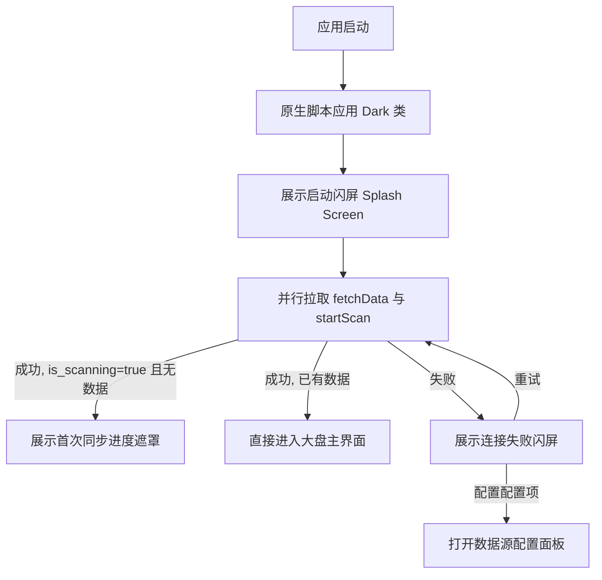

# 设计文档：AI 用量统计大盘启动白屏与后台初始化体验优化

本文档详述了如何通过引入显式启动闪屏（Splash Screen）、原生主题预加载脚本以及更健全的 API 连接容错状态机，解决应用启动时的白屏、深色模式下白色闪光、以及首次数据同步时状态突变的不良用户体验。

## 1. 背景与目标

当前版本的 AI Token Monitor 存在以下体验痛点：
- **深色模式白屏闪烁：** 网页的主题判定（是否添加 `.dark` 类）由 React 的 `useEffect` 驱动。在 React 加载、解析并执行之前，网页在首帧渲染时总是默认呈现白色背景，造成刺眼的“白色闪烁”。
- **白屏等待与骨架跳变：** 当后端正在进行数据初始化或首次扫描时，前端由于尚未获取到 `scanStatus`，会短暂呈现一个数据全为 `0` 且为空的仪表盘骨架。几百毫秒后一旦 API 返回，又突然切换为全屏扫描遮罩。
- **缺失后端离线异常保护：** 如果后端连接超时或出错，前端将一直停留在无数据的骨架屏或加载中状态，无法提示用户错误，也无法在当前阶段修改数据源配置。

**优化目标：**
1. 消除暗黑模式下的首帧白色闪烁。
2. 启动时立即显示优雅的加载动画（启动闪屏），绝不显示空白仪表盘。
3. 如果是首次同步，平滑过渡到“首次初始化同步进度遮罩”；若已同步过数据，则直接进入大盘。
4. 在启动闪屏中集成错误捕获，支持连接失败时一键重试与配置数据库配置。

---

## 2. 技术设计方案

### 2.1 主题闪烁消除设计

在 `index.html` 的 `<head>` 部分加入同步执行的 Inline JavaScript 脚本。该脚本将在 CSS 和 HTML 结构渲染前，直接拦截并设定根节点主题：

```html
<script>
  (function() {
    try {
      const saved = localStorage.getItem('theme');
      if (saved === 'dark') {
        document.documentElement.classList.add('dark');
      } else {
        document.documentElement.classList.remove('dark');
      }
    } catch (e) {
      console.error(e);
    }
  })();
</script>
```

### 2.2 状态机与过渡流程

在 `src/App.tsx` 中引入以下状态变量：
- `appInitializing`: `boolean`（默认为 `true`），标识应用是否正处于最开端的 API 握手/拉取阶段。
- `initError`: `string | null`（默认为 `null`），捕获并记录首屏 API 握手失败的异常详情。

#### 状态过渡图示：



### 2.3 关键文件改动

#### `index.html`
- 在 `<head>` 中注入 Inline Theme 脚本。

#### `src/App.tsx`
1. **状态声明：**
   ```typescript
   const [appInitializing, setAppInitializing] = useState(true);
   const [initError, setInitError] = useState<string | null>(null);
   ```

2. **API 握手重构：**
   改造首屏自动执行的 API 请求。我们将 `startScan` 与 `fetchData` 作为关键路径进行包装：
   ```typescript
   const performInitialSync = async () => {
     setInitError(null);
     setAppInitializing(true);
     try {
       // 1. 尝试并行请求关键接口
       const [scanRes, metricsRes] = await Promise.all([
         fetch(`/api/scan/start?t=${Date.now()}`),
         fetch(`/api/metrics?source=${source}&start_date=${startDate}&end_date=${endDate}&t=${Date.now()}`)
       ]);
       
       if (!scanRes.ok || !metricsRes.ok) {
         throw new Error(`后台服务响应异常 (Scan: ${scanRes.status}, Metrics: ${metricsRes.status})`);
       }
       
       const scanStatusData = await scanRes.json();
       const metricsData = await metricsRes.json();
       
       // 2. 更新状态
       setScanStatus(scanStatusData);
       setData(metricsData);
       
       if (scanStatusData.is_scanning) {
         pollScanStatus();
       }
     } catch (err: any) {
       console.error("启动初始化失败:", err);
       setInitError(err.message || String(err));
     } finally {
       setAppInitializing(false);
     }
   };
   ```

3. **渲染分支重构：**
   ```typescript
   // 分支 1：连接出现异常
   if (initError) {
     return <ErrorSplashScreen error={initError} onRetry={performInitialSync} onOpenConfig={() => setIsConfigOpen(true)} />;
   }

   // 分支 2：正在初始化 API
   if (appInitializing) {
     return <LoadingSplashScreen />;
   }

   // 分支 3：已经就绪，后续正常渲染
   return (
     <div className="relative min-height-screen text-text-primary">
       ...
       {/* 首次初始化同步进度遮罩 */}
       {(!data || (data.totals.total_sessions === 0 && data.sessions.length === 0)) && scanStatus?.is_scanning && (
          ...
       )}
       ...
       {/* 数据配置面板 */}
       {isConfigOpen && ( ... )}
     </div>
   );
   ```

---

## 3. UI/UX 视觉规范

### 3.1 Loading SplashScreen 视觉设计
- **背景：** 纯黑/深邃蓝背景 `bg-[#030712]`，辅以霓虹青与霓虹紫的呼吸渐变光效。
- **Logo 动画：** 渐变色双向旋转环，营造极具科技感的数据处理视觉反馈。
- **文字：** 醒目的 "AI Token Monitor" 标题及副标题 "正在初始化后台服务并同步数据，请稍候..."。

### 3.2 Error Connection SplashScreen 视觉设计
- **错误呈现：** 居中展示带有红色故障发光的警告卡片，展示具体报错细节。
- **操作项：** 提供“⚡ 重新连接服务”大按钮，以及在右上方保留配置图标，允许在页面无法加载时调起“系统数据源配置”，从而修改为正确的 PG 连接参数。
