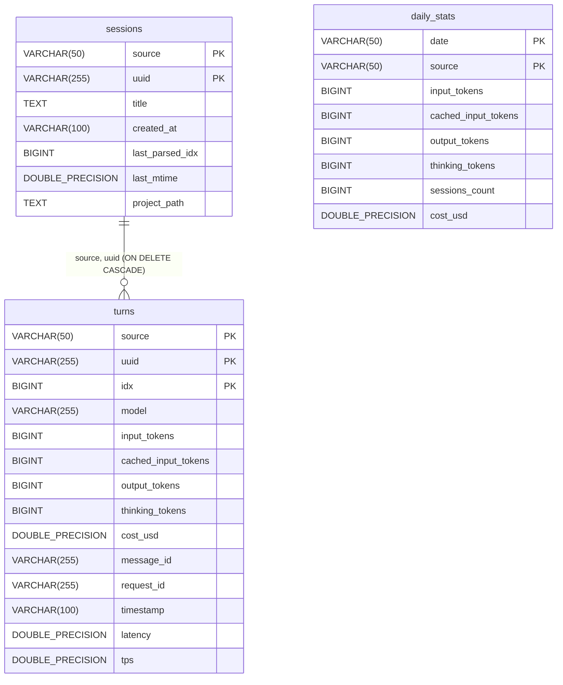

# 数据库重构与合并设计规约 (2026-05-28)

本文档详述了首个正式版本发布前，对 AI Token Monitor 的数据库架构所进行的一键式极简合并与代码清洗重构的技术规约。

---

## 1. 目标与背景

由于当前程序尚未正式发布给最终用户使用，我们不需要考虑任何历史版本的数据迁移、向后兼容性或旧字段平滑过渡问题。这是将系统数据库层彻底“瘦身”并优化至最佳状态的绝佳窗口期。

### 改造目标：
1. **合并数据库迁移脚本 (Consolidated Migrations)**：将 SQLite 和 PostgreSQL 目录下的多版本数据库迁移脚本（`V1` ~ `V4`）合并为唯一的 `V1` 初始版本。
2. **清洗 db_adapter.rs 死代码**：彻底移除热重载连接池架构下遗留的 `DbConn` 统一包装类、`RowWrapper`、`SqlParam` 及其相关行映射、占位符翻译的冗余模块。
3. **精简 db.rs 初始化与同步逻辑**：移除 `init_cache_db` 中针对新列存在性的 pragma 运行时检测、模型名称历史重命名修复逻辑，以及 PostgreSQL 增量数据同步中针对老版 `db_meta` 一键清洗的累赘代码。

---

## 2. 详细设计与规范

### 2.1 数据库 Schema 合并设计

SQLite 与 PostgreSQL 将分别保留唯一的迁移脚本：
- [V1__initial_sqlite_schema.sql](file:///d:/VibeCoding/ai-token-monitor/src-tauri/migrations/sqlite/V1__initial_sqlite_schema.sql)
- [V1__initial_postgres_schema.sql](file:///d:/VibeCoding/ai-token-monitor/src-tauri/migrations/postgres/V1__initial_postgres_schema.sql)

所有的历史增量补丁（`V2__add_latency_and_tps.sql`、`V3__add_performance_indexes.sql`、`V4__add_daily_stats_cache.sql`）都将从物理目录中彻底删除。

#### 完整的最新表结构关系定义如下（以 Postgres 为例）：



---

### 2.2 `db_adapter.rs` 极简重构规范

将原本 400 余行的复杂桥接层删除，仅保留工具函数与核心 Postgres 表迁移运行器：

1. **保留的迁移方法**：
   ```rust
   pub fn init_postgres_tables(client: &mut postgres::Client) -> Result<(), String>
   ```
   该方法仅做一件事：自动使用会话级排他锁 `pg_advisory_lock(763529)` 运行 `refinery` 迁移，完毕后自动解锁。不再需要使用 `Mutex` 包装 client 传参，避免多余的所有权拆装。
2. **保留的工具方法**：
   - `get_user_profile_dir() -> String`
   - `get_default_sqlite_path() -> PathBuf`
   - `parse_pg_url(url: &str) -> Option<(String, String, String, String, String)>`
3. **彻底删除的模块**：
   - `SqlParam` 绑参变体。
   - `RowWrapper` 行字段读取特质及其 `SqliteRowWrapper` / `PostgresRowWrapper` 实现。
   - `DbConn` 多库物理连接池包装枚举及 `GLOBAL_CONN`、`init_new_conn`、`get_active_conn`、`reset_conn_pool` 连接句柄。
   - 动态转译方法 `normalize_sql`、参数解析器 `to_sqlite_params` / `to_pg_owned` / `to_pg_refs`。

---

### 2.3 `db.rs` 的极简化改造规范

#### 1) 简化本地缓存初始化 `init_cache_db`
直接执行最全最简的 `CREATE TABLE` 语句，直接创建包含 `latency` 和 `tps` 列的 `turns` 表。
- **删除**：`pragma_table_info('turns')` 运行时对 latency 列的存在性检测以及 `ALTER TABLE` 升级逻辑。
- **删除**：历史脏数据清洗 `UPDATE turns SET model = 'gemini-3.5-flash' WHERE model = 'gemini-3-flash-a'`。

#### 2) 精简 `sync_local_to_postgres` 与 `get_pg_aggregated_metrics` 中的 Postgres 初始化
- **旧做法**：
  ```rust
  let db_conn = crate::db_adapter::DbConn::Postgres(std::sync::Mutex::new(pg_client));
  crate::db_adapter::init_tables(&db_conn)...
  pg_client = match db_conn { ... }
  ```
- **新做法**：直接在持有的 `pg_client` 引用上调用极简 API：
  ```rust
  crate::db_adapter::init_postgres_tables(&mut pg_client)
      .map_err(|e| format!("执行 PostgreSQL 数据库迁移失败: {}", e))?;
  ```
- **删除**：对 `db_meta` 辅助表的存在性判断以及对 `claude_code` / `codex` 历史老数据清洗的整个逻辑（即从 `db.rs` 移除两百多行多余的同步检测分支）。

---

## 3. 验证与测试方案

### 3.1 单元测试与物理验证
1. **删除本地现有缓存数据库**：
   手动删除物理文件 `~/.ai_token_monitor/token_stats.db`，启动应用，确认 `init_cache_db` 能够零错误新建整个包含完整最新列与索引的缓存库。
2. **连接 PostgreSQL 网络数据库测试**：
   新建一个空的本地 PostgreSQL 数据库，配置 `.env` 并通过测试连接及保存配置。确认能够完美触发 `init_postgres_tables` 并一次性跑完最新的 `V1` 迁移，无任何死锁与主键冲突发生。
3. **功能跑通验证**：
   对 Claude Code 与 Gemini 历史记录执行增量同步，确认所有数据流式写入、大盘预计算缓存重建均运作如初。

---

> **设计规约审核**：
> - 方案聚焦明确，为首发版本提供了极致清爽的数据库层重构指引。
> - 表结构与物理工具函数功能完美留存，去除了所有未被执行的“过度设计”部分。
