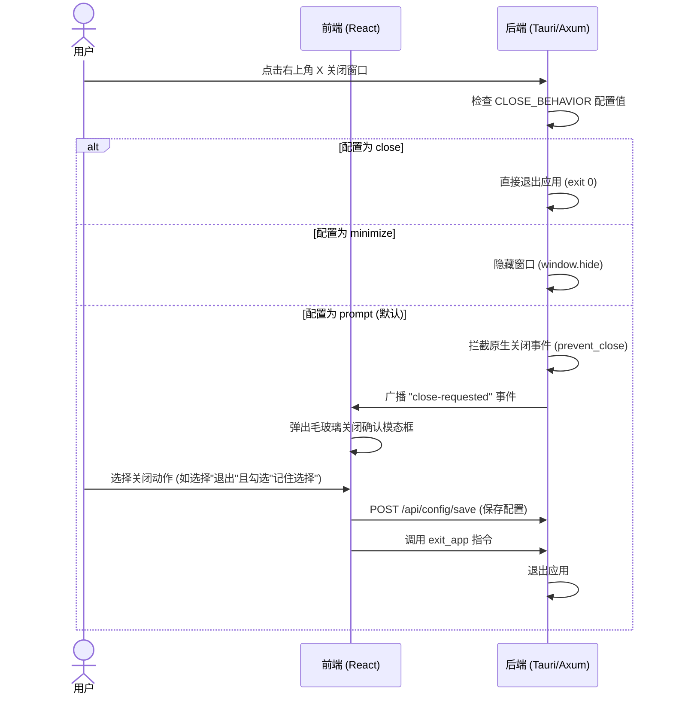

# 系统托盘右键退出菜单与窗口关闭行为设计规约

本文档定义了如何在“智业 AI 治理平台”中实现窗口关闭行为定制（直接关闭或隐藏至系统托盘）以及系统托盘右键“退出程序”菜单的技术设计规约。

## 1. 业务需求描述

1. **窗口关闭拦截与行为定制**
   - 用户点击窗口右上角“关闭”（X）按钮时，如果是首次关闭（或配置为“每次关闭时确认”），需要弹出一个对话框，询问用户是直接“关闭程序”还是“最小化到后台”（驻留托盘）。
   - 默认选中“关闭程序”选项，且弹窗中必须带有“记住我的选择，后续不再提示”复选框。
   - 如果用户勾选了“记住我的选择”，系统会将用户的选择保存为默认的窗口关闭行为配置。
   - 后续点击关闭时，系统直接根据用户的默认选择执行相应操作，不再弹出确认对话框。
   - 用户可以随时在配置页面修改该行为。
2. **系统托盘右键菜单**
   - 右键点击系统托盘图标时，必须显示一个上下文菜单，菜单中包含：
     1. **显示主窗口**：唤起大盘主窗口。
     2. **退出程序**：直接安全退出整个软件程序。
   - 修复目前没有右键菜单、程序无法退出的问题。

---

## 2. 技术架构与交互流程

本方案采用 **React 前端自定义模态框** + **Tauri 窗口事件拦截** 的组合设计，保证视觉设计（Glassmorphism 暗色霓虹风格）的高度一致与优雅。



---

## 3. 具体修改细节

### 3.1 配置文件与后端数据处理 (`src-tauri/src/server.rs` & `db.rs`)

1. **环境变量定义**
   - 增加环境变量 `CLOSE_BEHAVIOR`，其值定义如下：
     - `prompt`：每次关闭时弹窗确认（默认值）。
     - `close`：直接关闭并退出程序。
     - `minimize`：最小化到系统托盘。

2. **接口与结构体拓展**
   - 修改 `server::ConfigReq` 结构体：
     ```rust
     #[derive(serde::Deserialize, serde::Serialize)]
     pub struct ConfigReq {
         // ... 现有字段 ...
         pub close_behavior: Option<String>,
     }
     ```
   - 修改 `handle_config_get` 接口：
     从环境变量中读取 `CLOSE_BEHAVIOR`，默认为 `"prompt"`，并填入返回体。
   - 修改 `handle_config_save` 接口：
     从请求体中读取 `close_behavior`，如果存在则写入 `.env` 文件，并通过 `std::env::set_var("CLOSE_BEHAVIOR", ...)` 动态更新当前的内存变量。

### 3.2 窗口事件监听与托盘菜单配置 (`src-tauri/src/main.rs`)

1. **自定义 Tauri 命令**
   提供给前端的直接操作接口：
   - `exit_app`：调用 `app_handle.exit(0)` 退出程序。
   - `hide_window`：调用 `window.hide()` 隐藏窗口。

2. **拦截 CloseRequested 事件**
   - 重构 `tauri::Builder::default().on_window_event` 监听器：
     ```rust
     .on_window_event(|window, event| {
         if let tauri::WindowEvent::CloseRequested { api, .. } = event {
             let behavior = std::env::var("CLOSE_BEHAVIOR").unwrap_or_else(|_| "prompt".to_string());
             match behavior.as_str() {
                 "close" => {
                     window.app_handle().exit(0);
                 }
                 "minimize" => {
                     api.prevent_close();
                     let _ = window.hide();
                 }
                 _ => {
                     // 拦截原生关闭，转由前端处理确认逻辑
                     api.prevent_close();
                     let _ = window.emit("close-requested", ());
                 }
             }
         }
     })
     ```

3. **创建系统托盘右键菜单**
   - 在 `setup` 钩子中，构建托盘右键菜单：
     ```rust
     use tauri::menu::{Menu, MenuItem};

     let quit_i = MenuItem::with_id(app, "quit", "退出程序", true, None::<&str>)?;
     let show_i = MenuItem::with_id(app, "show", "显示主窗口", true, None::<&str>)?;
     let tray_menu = Menu::with_items(app, &[&show_i, &quit_i])?;
     ```
   - 在 `TrayIconBuilder` 中绑定 `menu(&tray_menu)`：
     ```rust
     .on_menu_event(|app, event| {
         match event.id.as_ref() {
             "quit" => {
                 app.exit(0);
             }
             "show" => {
                 if let Some(window) = app.get_webview_window("main") {
                     let _ = window.show();
                     let _ = window.set_focus();
                 }
             }
             _ => {}
         }
     })
     ```

### 3.3 前端交互与视觉逻辑 (`src/App.tsx`)

1. **状态扩充**
   - `closeBehavior`：`'prompt' | 'close' | 'minimize'`（默认 `'prompt'`）。
   - `showCloseConfirmModal`：是否显示关闭确认弹窗。
   - `dontPromptAgain`：复选框，默认 `true`。

2. **事件监听**
   在 React 组件挂载时，监听后端发送的 `'close-requested'` 事件：
   ```typescript
   useEffect(() => {
     let unlisten: () => void;
     listen('close-requested', () => {
       setShowCloseConfirmModal(true);
     }).then((u) => { unlisten = u; });
     return () => { unlisten?.(); };
   }, []);
   ```

3. **关闭确认弹窗 (UI 实现)**
   - 弹窗采用高斯模糊背景（`backdrop-blur-md bg-black/60`）和 `.glass-card` 暗色霓虹微发光卡片。
   - **交互处理**：
     - **“退出程序”按钮**（主色调）：
       - 如果 `dontPromptAgain` 为 `true`，则异步请求 `/api/config/save` 将 `close_behavior` 保存为 `"close"`，接着通过 `invoke("exit_app")` 退出。
       - 如果为 `false`，则直接通过 `invoke("exit_app")` 退出。
     - **“最小化到后台”按钮**（次级按钮）：
       - 如果 `dontPromptAgain` 为 `true`，则异步请求 `/api/config/save` 将 `close_behavior` 保存为 `"minimize"`，接着通过 `invoke("hide_window")` 隐藏，并关闭模态框。
       - 如果为 `false`，则直接通过 `invoke("hide_window")` 隐藏并关闭模态框。

4. **配置页面优化**
   - 修改设置弹窗的第一个标签名称为 `🖥️ 数据源与系统设置`。
   - 在其内部“数据库类型”配置项下方，新增 **“窗口关闭行为”** 配置项。
   - 提供 Select 下拉菜单：
     - `每次关闭时询问确认` (映射为 `prompt`)
     - `直接退出软件程序` (映射为 `close`)
     - `最小化隐藏到系统托盘` (映射为 `minimize`)
   - 确保在点击“保存并应用配置”时，连同 `close_behavior` 配置项一并提交至 `/api/config/save`。

---

## 4. 验证计划

1. **编译验证**：运行 `npm run build` 和 `cargo check` 确保代码无编译错误。
2. **托盘右键功能测试**：
   - 启动应用，右键点击托盘，点击“显示主窗口”应可重新激活窗口。
   - 右键点击托盘，点击“退出程序”，整个程序应立刻彻底关闭。
3. **关闭拦截功能测试**：
   - 点击右上角关闭（X），首次操作应成功唤起毛玻璃确认弹窗。
   - 在弹窗中选择“最小化到后台”且不勾选“不再提示”，窗口应隐藏，双击或单击托盘图标重新显示窗口；再次点击 X 关闭应仍会弹窗。
   - 选择“最小化到后台”且**勾选**“不再提示”，窗口隐藏；再次打开窗口后点击 X 应当直接静默隐藏，不再弹窗。
   - 到系统配置页修改为“每次关闭时询问确认”，点击 X 关闭应重新触发弹窗。
   - 在弹窗中选择“直接关闭”且**勾选**“不再提示”，程序退出；下次启动程序，点击 X 应直接退出。
