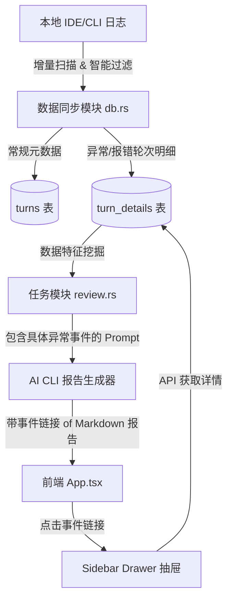

# 智能复盘会话细节提取与代码级诊断设计规范

本规范定义了如何在 `AI 复盘与治理中心` 中支持捕获本地 IDE / CLI（如 `Claude Code`、`Antigravity` 等）的具体执行过程（用户原始提问、执行命令、报错日志等），并通过前端侧边抽屉进行溯源，以提供高度定制化的精准效能分析报告。

## 1. 背景与痛点

目前，AI 复盘报告在执行时，仅向 AI 引擎提供了一份纯数字的统计快照（总 Token、总费用、缓存命中率等）。
AI 引擎无法获知用户在开发时的具体行为，例如：
- 针对哪个文件遇到了何种编译错误？
- 是否陷入了“修改 -> 报错 -> 再修改”的无效重试死循环？
- 是否在单行 CSS 调整时带入了过大的上下文？

这导致生成的效能分析报告偏向话术套路，缺乏“代码级、场景级”的具体诊断和落地行动项。

---

## 2. 优化设计方案

本方案采用 **「智能/分级事件捕获」** 与 **「抽屉式 (Sidebar Drawer) 联动溯源」** 架构，兼顾数据隐私、存储大小与效能诊断的精准度。



---

## 3. 详细设计实现

### 3.1 数据库结构升级 (Database)

在 SQLite 缓存库中新增一张 `turn_details` 表，用于存储按需采集的异常轮次明细：

```sql
CREATE TABLE IF NOT EXISTS turn_details (
    source TEXT NOT NULL,
    uuid TEXT NOT NULL,
    idx INTEGER NOT NULL,
    user_prompt TEXT,          -- 该轮次用户的原始提问文本
    executed_commands TEXT,    -- 运行过的终端命令 (JSON 数组)
    failed_commands TEXT,      -- 执行失败的命令及 stderr 报错日志 (JSON 数组)
    modified_files TEXT,       -- 该轮修改过的文件路径列表 (JSON 数组)
    PRIMARY KEY (source, uuid, idx),
    FOREIGN KEY(source, uuid, idx) REFERENCES turns(source, uuid, idx) ON DELETE CASCADE
);
```

### 3.2 后端数据提取引擎升级 (Sync & Parse)

升级 `src-tauri/src/db.rs` 中的 `sync_claude_code` 等同步逻辑。在遍历 jsonl 会话行解析 Turn 轮次时：
1. **轻量元数据**：每一轮次仍解析 Token、费用等并写入 `turns` 表。
2. **触发深度抓取判定**：
   - 提取该行日志中执行过的命令。如果存在命令且 `exitCode != 0`。
   - 或触发频率判定：在 10 分钟内，针对同一文件路径发生了连续 3 次以上的修改及编译报错。
3. **明细入库**：一旦判定触发，解析出该轮次对应的 `user` 提问文本（Prompt）、报错命令的 `stderr` 输出（限制最大 2000 字符，避免数据库膨胀），将其与修改的文件路径一同写入 `turn_details` 表。

### 3.3 报告提示词生成增强 (Prompt Engine)

在 `src-tauri/src/review.rs` 中：
1. **特征提取 SQL**：在新建报告任务 `handle_create_task` 时，通过 SQL 查询该时段内 `turn_details` 中的异常数据：
   ```sql
   SELECT user_prompt, failed_commands, modified_files
   FROM turn_details
   WHERE source IN (已选IDE) AND timestamp 处于选定时段
   ORDER BY timestamp DESC LIMIT 15
   ```
2. **事件化拼装**：将提取到的报错细节、文件重试路径提炼为简洁的「效能异常事件轴」：
   - *事件例 1*：陷入 `src-tauri/src/review.rs` 的 4 次编译重试，命令 `cargo check` 报错 `rusqlite unresolved import`。
   - *事件例 2*：大上下文冗余提问。用户提问仅 15 字，但读取了 4500 行的 `db.rs`。
3. **Prompt 占位符替换**：将此特征事件轴作为上下文注入发送给 AI CLI 的 Prompt。

### 3.4 API 端点设计

后端新增专门的 API 端点供前端抽屉获取明细：

#### GET `/api/review/turns/details`
- **参数**：
  - `source`: 来源（如 `claude_code`）
  - `uuid`: 会话 UUID
  - `idx`: 轮次 index
- **返回 JSON**：
  ```json
  {
    "source": "claude_code",
    "uuid": "session-12345",
    "idx": 5,
    "user_prompt": "分析下面的需求，编写一份开发计划：...",
    "executed_commands": ["cargo check", "cargo build"],
    "failed_commands": [
      {
        "command": "cargo build",
        "exit_code": 101,
        "stderr": "error[E0432]: unresolved import `rusqlite`"
      }
    ],
    "modified_files": ["src-tauri/src/db.rs"]
  }
  ```

### 3.5 前端交互设计 (Frontend UI)

1. **链接式跳转**：
   在 Markdown 报告中，当提到具体事件时，AI 引擎输出特定的链接语法，如：
   `[查看 Turn #5 编译报错详情](turn-details://claude_code/session-12345/5)`
   前端 `react-markdown` 拦截此协议的 A 标签，触发抽屉打开事件。

2. **Sidebar Drawer (右侧明细抽屉)**：
   - 采用右侧拉出式抽屉布局，宽度占页面的 40%，具备高斯模糊半透明背景和暗黑拟态风格（符合 `dashboard-ui-style` 规范）。
   - **内容区域**：
     - 顶部：显示 IDE/CLI 来源及 Turn 编号，提供关闭按钮。
     - 用户提问面板：使用卡片展示用户的 Prompt，限高折叠。
     - 终端命令面板：极客风格终端（Monospace 字体，深黑色背景），高亮展示执行失败的终端命令。
     - 报错日志区：高亮显示具体的 `stderr` 编译/运行报错信息。
     - 修改的文件：列出该 Turn 变更的文件列表。

---

## 4. 隐私与安全考量

1. **本地存储**：捕获的 Prompt、代码路径、报错明细全部保留在本地的 SQLite 中，不会上传到任何云端服务。
2. **分析阶段**：在生成复盘报告时，只将提取出的“异常诊断特征摘要”（不含完整源码）插入 Prompt 传给 AI。
3. **数据清理**：当删除某次复盘历史或清理缓存时，关联 of `turn_details` 将通过 `ON DELETE CASCADE` 级联删除。
