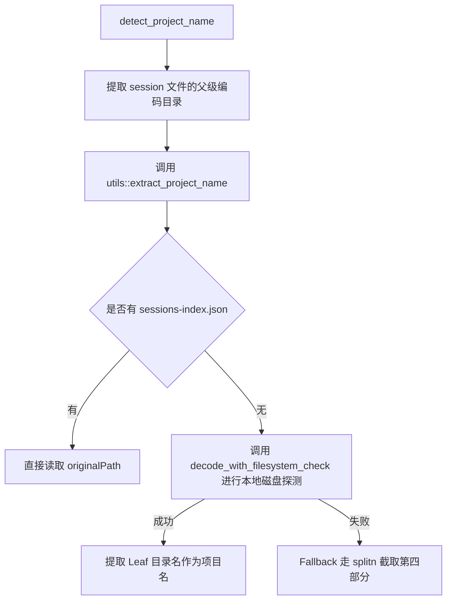

# 精确项目名解析机制设计文档

本项目 `token-insight` 在解析 Claude Code 项目名时遇到了解析错误的问题（会将形如 `-d-VibeCoding-ai-token-monitor` 这样的原始编码路径直接解析为项目名）。
为了解决该问题，我们将移植并参考 `claude-code-history-viewer` 项目中成熟的解析机制。

## 需求与设计目标
- 能够准确还原被 Claude Code 编码的本地路径，提取真实的最后一级目录名作为项目名称（例如，将 `-d-VibeCoding-ai-token-monitor` 还原为 `ai-token-monitor`）。
- 优先读取 Claude 项目存储目录下的 `sessions-index.json` 中的 `originalPath`。
- 如果没有索引文件，通过本地磁盘存在性探测递归识别实际的分隔符位置。
- 如果本地磁盘路径已被删除或无法访问，通过硬分割（分段拆解）进行兜底解析。
- 无需考虑历史数据兼容性，仅需重新解析新抓取或全量重刷的数据。

## 架构设计

在 `src-tauri/src` 目录下新建 `utils` 模块，将所有逻辑复杂的路径编解码、项目名解析函数独立在该模块中，以保持大文件 `db.rs` 的整洁。

### 1. 新增 `utils.rs` 接口定义
- `pub fn decode_project_path(session_storage_path: &str) -> String`
  - 获取 `session_storage_path` 目录下的 `sessions-index.json` 并尝试解析 `originalPath`。
  - 若失败，从 `session_storage_path` 中解析编码的部分并进行磁盘探测或硬切分还原。
- `pub fn extract_project_name(raw_project_name: &str) -> String`
  - 根据前导符 `-` 剔除，尝试通过文件系统校验还原项目路径，若能提取则返回其最后一级目录；若失败则兜底使用 `splitn(4, '-')` 取第四部分。

### 2. 修改 `main.rs`
- 在头部声明 `mod utils;` 使得新模块生效。

### 3. 修改 `db.rs`
- 替换现有 `detect_project_name(project_path: Option<&str>)` 逻辑。
- 逻辑如下：
  1. 输入通常是 `.jsonl` 文件的绝对路径。例如 `C:\Users\xxx\.claude\projects\-d-VibeCoding-ai-token-monitor\session.jsonl`。
  2. 使用 `Path` 工具找到其父级目录的绝对路径，例如 `C:\Users\xxx\.claude\projects\-d-VibeCoding-ai-token-monitor`。
  3. 调用 `utils::decode_project_path` 传入该目录，获取解析出的原真实项目路径（如 `D:\VibeCoding\ai-token-monitor`）。
  4. 使用 `Path::new(&decoded).file_name()` 获得真正的叶子目录 `ai-token-monitor` 作为项目名。

## 测试与验证方案

### 自动化测试
在 `utils.rs` 中编写测试用例，覆盖：
- 存在 `sessions-index.json` 时的路径还原。
- 不存在 `sessions-index.json` 时，本地存在/不存在包含 `-` 目录的磁盘探测情况。
- Fallback 情况的切分测试。
- 在 `db.rs` 的 `detect_project_name` 单元测试中增加更多用例，保证测试均能运行通过。

### 手动验证
- 删除本地现有的 `token_stats.db` 缓存数据库。
- 启动 `pnpm dev` 触发同步流程，进入大盘页面查看“按令牌数排名的项目”图表，确认项目名已正确显示为 `ai-token-monitor`。
